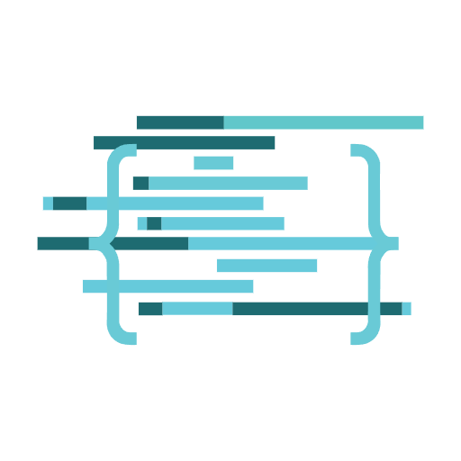

<p align="center">
  
</p>

# covdbg-mcp

MCP server for [covdbg](https://covdbg.com/): C++ code coverage on Windows for AI agents. Run tests, find uncovered code, and add targeted tests. No rebuild required.

covdbg measures coverage of the Windows x64 binaries you already build, using their PDB debug information. It works like a debugger: it starts your executable, reads the PDB, and places lightweight probes while the program runs. The MCP server is built into the `covdbg` executable (since v1.3.0) and is started with `covdbg mcp`.

This repository holds the MCP registry metadata (`server.json`, `glama.json`) and the [MCP Bundle](https://github.com/modelcontextprotocol/mcpb) manifest (`manifest.json`) for covdbg. The server itself ships with covdbg.

## What an agent can do

1. **Run coverage** on a test executable without rebuilding it.
2. **Rank files** by uncovered lines.
3. **Read the uncovered code** with surrounding context.
4. **Add a focused test**, re-run it, and confirm the gap is closed.
5. **Query and merge** coverage databases (`.covdb`) with read-only SQL.

## Requirements

- Windows x64
- covdbg **1.3.0 or newer**
- An executable with PDB debug symbols (MSVC or any PDB-producing toolchain)
- A one-time `covdbg login`, or `COVDBG_PROJECT_TOKEN` for CI
- A `.covdbg.yaml` next to the target executable, or a `config_path` passed to `run` (see the [configuration reference](https://covdbg.com/docs/reference/configuration/))

## Install covdbg

- **Installer (recommended):** [installer.msi](https://covdbg.com/download/latest/installer.msi). It installs to `%LocalAppData%\Programs\Liasoft\covdbg` and adds that directory to your user `PATH`.
- **Portable:** [portable.zip](https://covdbg.com/download/latest/portable.zip). Extract it anywhere and add the directory to your `PATH` yourself.

Then open a new terminal and sign in:

```powershell
covdbg --version
covdbg login
```

## Client setup

The server uses **stdio** transport. Start it from your project directory, or pass `--workspace <dir>`.

### Claude Code

From the project directory:

```powershell
claude mcp add covdbg -- covdbg mcp
```

Or add a project `.mcp.json`:

```json
{
  "mcpServers": {
    "covdbg": {
      "command": "covdbg",
      "args": ["mcp"]
    }
  }
}
```

### VS Code

`.vscode/mcp.json`:

```json
{
  "servers": {
    "covdbg": {
      "type": "stdio",
      "command": "covdbg",
      "args": ["mcp", "--workspace", "${workspaceFolder}"]
    }
  }
}
```

### Cursor

`.cursor/mcp.json`:

```json
{
  "mcpServers": {
    "covdbg": {
      "command": "covdbg",
      "args": ["mcp"]
    }
  }
}
```

### Claude Desktop (MCP Bundle)

1. Download `covdbg.mcpb` from the [latest release](https://github.com/liasoft/covdbg-mcp/releases/latest).
2. Open it with Claude Desktop, or drag it into **Settings → Extensions**.
3. Set the following:
   - **covdbg executable:** the path to `covdbg.exe`. The default is the MSI install location.
   - **Workspace:** your project directory.
   - **Project token:** optional. Leave it empty if you have run `covdbg login`.

The bundle does not contain covdbg itself. It launches your installed `covdbg.exe`, so covdbg updates take effect without a new bundle.

## Tools

| Tool | Purpose | Main inputs |
| --- | --- | --- |
| `guide` | Workflow and configuration guidance | optional `topic` (`config`, `excludes`, `baseline`, `merging`, `uncovered`, `children`) |
| `discover` | Find executables and coverage databases | optional `root` |
| `run` | Start a coverage run; returns a run session right away | `target`; optional `target_arguments`, `config_path`, `output_path`, `follow_children` |
| `wait_run` | Wait briefly or collect the completed result | `session_id`; optional `timeout_seconds` |
| `cancel_run` | Terminate a run | `session_id` |
| `open_coverage` | Open an existing database read-only | `path` |
| `files` | Rank files by uncovered lines | `session_id`; optional `limit`, `max_coverage_percent` |
| `code` | Read uncovered source segments with context | `session_id`, `file_path` |
| `query` | Run one read-only SQL statement | `session_id`, `sql`; optional `max_rows` |
| `merge` | Combine databases | `input_paths`, `output_path` |
| `close` | Release a run or coverage session | `session_id` |

### Limits and behavior

- Run session IDs start with `run-`; coverage session IDs start with `covdb-`.
- At most 8 runs in flight and 32 open coverage sessions.
- `wait_run` blocks for at most 30 seconds. If it reports `stillRunning`, call it again.
- Run outcomes are `success`, `no_functions_to_track`, `license_failure`, or `error`.
- covdbg's exit code does not carry the target's exit code, so check test results separately.

## Environment variables

| Variable | Purpose |
| --- | --- |
| `COVDBG_PROJECT_TOKEN` | Project token for CI or headless use. Local use relies on `covdbg login`. |
| `COVDBG_OUTPUT` | Fixed default output location. Avoid reusing one location across a suite, since later runs overwrite earlier results. |

## Documentation

- [MCP Server](https://covdbg.com/docs/integrations/mcp/)
- [Quick Start Using AI](https://covdbg.com/docs/getting-started/ai-quick-start/)
- [CLI Command Reference](https://covdbg.com/docs/reference/cli-reference/)
- [Data and Telemetry](https://covdbg.com/docs/reference/data-and-telemetry/)

## Publishing (maintainers)

Keep `version` in `manifest.json` and `server.json`, and the release tag in the `server.json` package URL, in sync.

1. Build the bundle. `.mcpbignore` limits it to `manifest.json`, `icon.png` and `LICENSE`:

   ```powershell
   npx @anthropic-ai/mcpb validate manifest.json
   npx @anthropic-ai/mcpb pack . covdbg.mcpb
   ```

2. Create the GitHub release `v<version>` and upload `covdbg.mcpb` as an asset.
3. Put the bundle's hash into `fileSha256` in `server.json`:

   ```powershell
   (Get-FileHash covdbg.mcpb -Algorithm SHA256).Hash.ToLower()
   ```

4. Publish to the [MCP registry](https://registry.modelcontextprotocol.io/). The `com.covdbg/*` namespace uses DNS authentication on `covdbg.com`:

   ```powershell
   mcp-publisher login dns --domain covdbg.com --private-key <key>
   mcp-publisher publish
   ```

5. [Glama](https://glama.ai/mcp/servers) picks up `glama.json` from the repository.

## License

The metadata in this repository is licensed under the [Apache License 2.0](LICENSE). covdbg itself is licensed separately, with Free, Team, and Enterprise plans. See [covdbg.com](https://covdbg.com/) and the [Licensing FAQ](https://covdbg.com/docs/reference/licensing-faq/).
